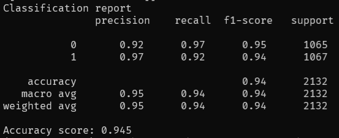
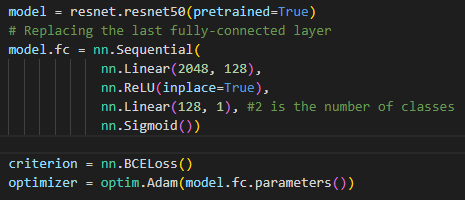
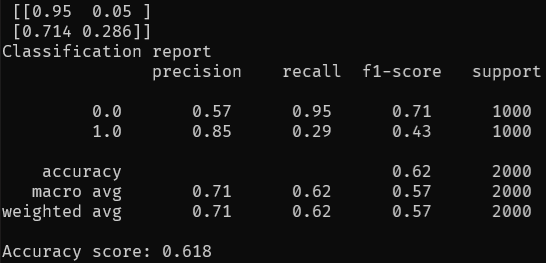

# Traning and evaluating Malware systems

## Authors

- Cirillo Benedetto   0622701741		b.cirillo6@studenti.unisa.it
- Montervino Dario    d.montervino@studenti.unisa.it
- Salzano Simone 		0622701726		s.salzano9@studenti.unisa.it
- Tisi Andrea 		0622701710		a.tisi7@studenti.unisa.it

## Index
- [Traning and evaluating Malware systems](#traning-and-evaluating-malware-systems)
  - [Authors](#authors)
  - [Index](#index)
  - [Introduction](#introduction)
  - [Hardware specification](#hardware-specification)
  - [Dataset Creation](#dataset-creation)
  - [Models](#models)
  - [MalConv](#malconv)
    - [Network architecture](#network-architecture)
    - [Feature extraction](#feature-extraction)
    - [Training and Validation phase](#training-and-validation-phase)
    - [Test phase](#test-phase)
  - [Image Based malware detector](#image-based-malware-detector)
    - [Network architecture](#network-architecture-1)
    - [Feature extraction](#feature-extraction-1)
    - [Training and Validation phase](#training-and-validation-phase-1)
    - [Test phase](#test-phase-1)
  - [Random forest](#random-forest)
    - [Network architecture](#network-architecture-2)
    - [Feature extraction](#feature-extraction-2)
    - [Training phase](#training-phase)
    - [Test phase](#test-phase-2)
  - [Generalization](#generalization)
  - [GAMMA](#gamma)
    - [Dataset Generation](#dataset-generation)
    - [Evaluate generalization](#evaluate-generalization)
  - [Conclusion](#conclusion)

## Introduction

The goal of this project is to build a robust malware detection system using machine learning and deep learning methodologies. In order to do this, we tranined three different models through a dataset containing excecutable file (both malign and benigns). After training the models to test the robustness we have implmented a GAMMA attack.

## Hardware specification

Training and test of the models and generation of the adversarial samples has been performed on a NVIDIA 3060Ti gpu (8Gb VRAM, 4864 CUDA Cores) on a local Windows 11 operative system, so the project has been constrained by our computational capabilities.

## Dataset Creation

Add link to dataset, describe how we created it and what's inside it.

In our project we have used two differnt data set:

- Dataset 1: the first dataset has been splitted in two part, one for the training and validation of the models and the second for the testing phase of them.
- Dataset 2: the second dataset has been used to two purpose, the first aim has been of testing the generalization of the models trained, and the second has been the creation of obfuscated samples for the GAMMA attack.

## Models

Among the various methodologies in the literature we decide to implement two deep learning models and one of machine learning.

## MalConv

### Network architecture

The network architecture is the following:

### Feature extraction

### Training and Validation phase

### Test phase

In the test phase we have computed the confusion matrix:

and calculated the accuracy on the dataset1:

## Image Based malware detector

### Network architecture

The network architecture is the following:

We used ResNet50 as base model and we added a custom head fit for our purpose.

### Feature extraction

The feature extraction has been made transforming each sample in our dataset to an image through the torchvision library. The image transforamtion settings are:

- Grayscale (3 output channels, to keep compatibility with ResNet50)
- Resize (224,224)
  
### Training and Validation phase

The training phase has been made by setting the batch size equal to 28 (which was the maximal amount that doesn't cause an out of memory exception on our device) and the number of epochs to 50, moreover early stopping has been implemented the in order to train more efficiently.

### Test phase

In the test phase we have computed the confusion matrix:

and calculated the accuracy on the dataset1:

CONSIDERATIONS

## Random forest

### Network architecture

The random forest classifier has been built starting from skLearn implementation, setting the parameters to:

- 100 estimators
- max depth to 3
- minimum number of samples required to split an internal node to 2 (in order to improve generalizzation)

### Feature extraction

The extraction of features has been made using Ember's PE features extractor which gives us several informations for each sample by analyzing every section of the Portable Executable, and saved as CSV files by using Pandas Framework.

### Training phase

In the training phase after the data features have been imported from the CSV the random forest were built, the validation phase is unnecessary because this is an ensemble learning method.

### Test phase

In the test phase we have computed the confusion matrix:

and calculated the accuracy on the dataset1:

## Generalization

In this phase we have been tested the robustness of our models, to do so we have been used the dataset2, which contains different types of executable (newer and armed)

sono armati e nuovi percio meno peffomance noi abbiamo addestrato su eseguibili disarmati e vecchi 

Malconv:

Image Based:

Random Forest:

nomina il vincitore

## GAMMA

In the GAMMA implemetation we implemented GAMMA library from SecML Malware: [link to the GitHub repository](https://github.com/pralab/secml_malware) by Luca Demetrio and Battista Biggio.

GAMMA has been used to obfuscate malicious samples in order to attack our models and evaluate their robusteness.

The reference model used to generate the adversarial samples was our Malconv model. We then have evaluated the transferability of the attack on the other two models that we have trained.

### Dataset Generation

In order to generate the adversarial samples we have provided a population corresponding to the benign file in the dataset2 and we have choosen 11 malwares from the same dataset that were correctly classifier as malwares by our Malconv model.

Our aim was to evaluate the impact of the attack by changing GAMMA's parameters, specifically we choose:

- population_size = 30
- penalty_regularizer = 1e-2
- iterations = 100  

### Evaluate generalization

## Conclusion

link to the repo