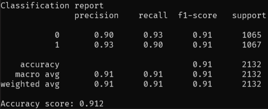
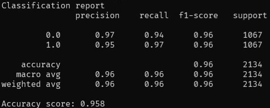
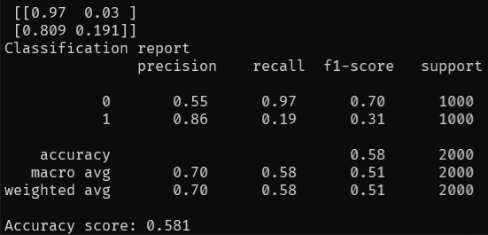
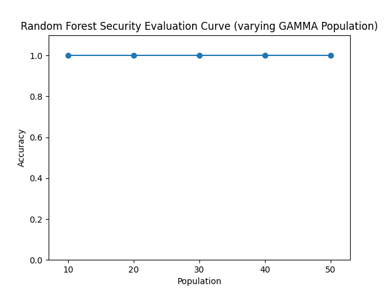
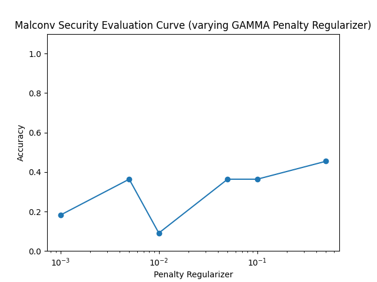
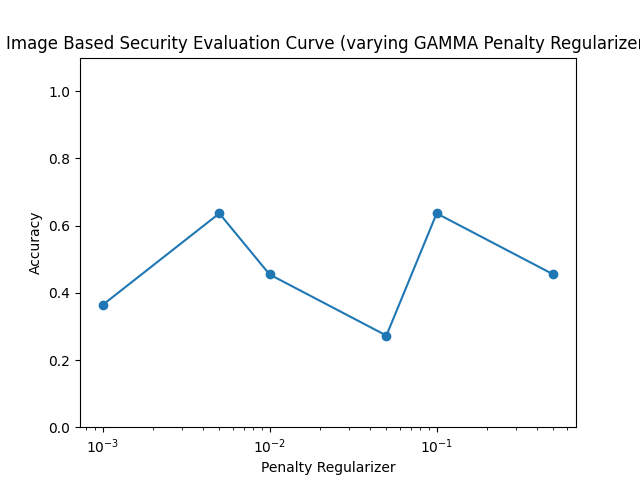
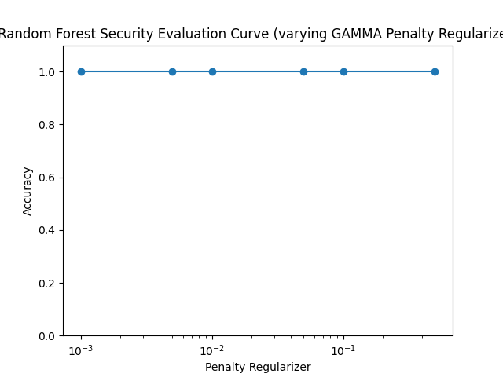
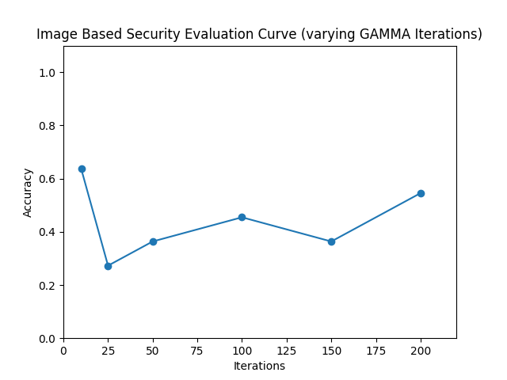
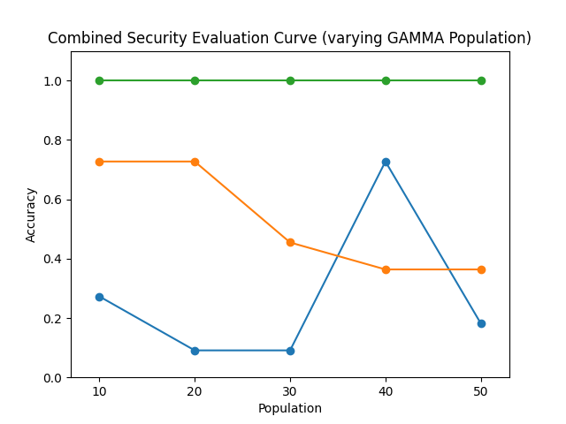
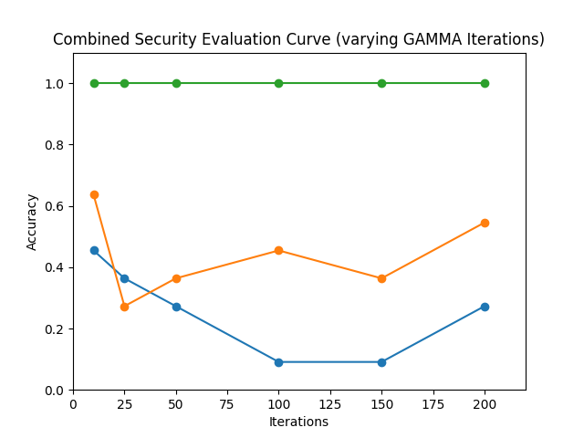

# Traning and evaluating Malware systems

## Authors

- Cirillo Benedetto   0622701741		b.cirillo6@studenti.unisa.it
- Montervino Dario   0622701729 d.montervino@studenti.unisa.it
- Salzano Simone 		0622701726		s.salzano9@studenti.unisa.it
- Tisi Andrea 		0622701710		a.tisi7@studenti.unisa.it

## Index
- [Traning and evaluating Malware systems](#traning-and-evaluating-malware-systems)
  - [Authors](#authors)
  - [Index](#index)
  - [Introduction](#introduction)
  - [Hardware specification](#hardware-specification)
  - [Dataset Creation](#dataset-creation)
  - [Models](#models)
  - [MalConv](#malconv)
    - [Network architecture](#network-architecture)
    - [Feature extraction](#feature-extraction)
    - [Training and Validation phase](#training-and-validation-phase)
    - [Test phase](#test-phase)
  - [Image Based malware detector](#image-based-malware-detector)
    - [Network architecture](#network-architecture-1)
    - [Preprocessing](#preprocessing)
    - [Training and Validation phase](#training-and-validation-phase-1)
    - [Test phase](#test-phase-1)
  - [Random forest](#random-forest)
    - [Network architecture](#network-architecture-2)
    - [Feature extraction](#feature-extraction-1)
    - [Training phase](#training-phase)
    - [Test phase](#test-phase-2)
  - [Generalization](#generalization)
  - [GAMMA](#gamma)
    - [Dataset Generation](#dataset-generation)
    - [Evaluation of Adversarial samples on Population\_size](#evaluation-of-adversarial-samples-on-population_size)
      - [Malconv](#malconv-1)
      - [Image Based](#image-based)
      - [Random forest](#random-forest-1)
    - [Evaluation of Adversarial samples on penalty\_regularizer](#evaluation-of-adversarial-samples-on-penalty_regularizer)
      - [Malconv](#malconv-2)
      - [Image Based](#image-based-1)
      - [Random forest](#random-forest-2)
    - [Evaluation of Adversarial samples on iterations](#evaluation-of-adversarial-samples-on-iterations)
      - [Malconv](#malconv-3)
      - [Image Based](#image-based-2)
      - [Random forest](#random-forest-3)
    - [Confronting results](#confronting-results)
      - [Population\_size](#population_size)
      - [Penalty\_regularizer](#penalty_regularizer)
      - [Iterations](#iterations)
  - [Conclusion](#conclusion)

## Introduction

The goal of this project is to build a robust malware detection system using machine learning and deep learning methodologies. In order to do this, we tranined three different models through a dataset containing excecutable file (both malign and benigns). After training the models to test the robustness we have implmented a GAMMA attack.

## Hardware specification

Training and test of the models and generation of the adversarial samples has been performed on a NVIDIA 3060Ti gpu (8Gb VRAM, 4864 CUDA Cores) on a local Windows 11 operative system, so the project has been constrained by our computational capabilities.

## Dataset Creation

Add link to dataset, describe how we created it and what's inside it.

In our project we have used two differnt data sets:

- Dataset 1: the first dataset has been splitted in two parts, one for the training and validation (80% training and 20% validation) of the models and the second for the testing phase of them. It has been provided py Prof. Carletti, however several benign files have been added to it in order to balance the nubmer of benign and malign files.
- Dataset 2: the second dataset has been used for two purposes, the first was to test the generalization of the models trained, and the second was to create the obfuscated samples for the GAMMA attack. The malign files were armed VirusTotal files provided by Prof. Carletti and the benign files were added from the same source we used to balance Dataset 1 with. 

## Models

Among the various methodologies in the literature we decide to implement two deep learning models and one of machine learning.

## MalConv

We used Malconv as the first model, which was the first architecture to demonstrate that neural networks can detect malwere starting from the bytes of the executable.

### Network architecture

We used the implementation provided by the creators of the *secml_malware* repository so as to use the gamma attack as described in section x.

The network architecture is the following:

### Feature extraction

Feature extraction is done through the network described above. First, is performed a projection step in an embedded space, then the obtanined representation is passed to two separate 1D convolutional layers, one of which passes through a gate layer. Finally, before the classification phase perfomed by a fully connect layer the time-averaged pooling is applied rather then avarage pooling.

### Training and Validation phase

We choose as input size  1 Mb, as the implemnation of emberMalConv, and we trained the network from scratch. We setting the batch size equal to 28 (which was the maximal amount that doesn't cause an out of memory exception on our device) and the number of epochs to 50, moreover early stopping has been implemented based on the value on the validation set in in order to train more efficiently.

### Test phase

In the test phase we have computed the confusion matrix:

and calculated the accuracy on the dataset1:

As we can see, the results obtained are quite good. The network has better performance on malware (TP), but still does not have low performance on benign (TN). This may be due to the fact that the test set files come from the same dataset on which the split into train validation and test was made.

## Image Based malware detector

We adopted a Transfer learning approach using ResNet50 as base model, pretrained with ImageNet weights, and we added a custom head fit for our purpose.

### Network architecture

The network architecture is the following:

### Preprocessing

In order to perform ResNet50's feature extraction, a series of transformation has been performed, turning a binary file into an image through a custom transformation function `BinToImg()`, then we used the torchvision transform library to perform other preprocessing transforms onto the new image. The image transformation settings are:

- Grayscale (3 output channels, to keep compatibility with ResNet50)
- Resize (224,224)
  
### Training and Validation phase

The training phase has been made by setting the batch size equal to 28 (which was the maximal amount that doesn't cause an out of memory exception on our device) and the number of epochs to 50, moreover early stopping has been implemented the in order to train more efficiently.

### Test phase

In the test phase we have computed the confusion matrix:

and calculated the accuracy on the test set of dataset1:

Of the three models, Image Based is the model that achieved the least accuracy on the test set.

## Random forest

### Network architecture

The random forest classifier has been built starting from skLearn implementation, setting the parameters to:

- 100 estimators
- max depth to 3
- minimum number of samples required to split an internal node to 2 (in order to improve generalization)

### Feature extraction

The extraction of features has been made using Ember's PE feature extractor which gives us several informations for each sample by analyzing every section of the Portable Executable, and saved as CSV files by using Pandas Framework.

### Training phase

In the training phase after the data features have been imported from the CSV the random forest were built, the validation phase is unnecessary because this is an ensemble learning method.

### Test phase

In the test phase we have computed the confusion matrix:

and calculated the accuracy on the dataset1:

We can see that Random Forest achieved the highest accuracy score of the three models on the test set.

## Generalization

In this phase we have tested the robustness of our models, to do so we have used the dataset2, which contains different types of executable than those found in dataset1, in fact they are more recent and armed.

Malconv:

Image Based:

Random Forest:

As we can see, performances severally worsened comparing to the performance obtained on dataset1. It's higly likely that the difference in performances is caused by the different natures of the two datasets. In fact, in both the test evaluation and the generalization evaluation most of the benign files are correctly classified because they come from the same source, as opposed to the malign files.

Another important thing to report is that while in the testing phase Random Forest was the most accurate model, on the new dataset Image Based got the highest accuracy of the three models, meaning that it is the most capable of generalizing.

## GAMMA

In the GAMMA implemetation we implemented GAMMA library from SecML Malware: [link to the GitHub repository](https://github.com/pralab/secml_malware) by Luca Demetrio and Battista Biggio.

GAMMA has been used to obfuscate malicious samples in order to attack our models and evaluate their robusteness.

The reference model used to generate the adversarial samples was our Malconv model. We then have evaluated the transferability of the attack on the other two models that we have trained.

### Dataset Generation

In order to generate the adversarial samples we have provided a population corresponding to the benign file in the dataset2 and we have choosen 11 malwares from the same dataset that were correctly classifier as malwares by our Malconv model.

Our aim was to evaluate the impact of the attack by changing GAMMA's parameters, specifically we choose:

- `population_size` (30 by default)
- `penalty_regularizer` (0.01 by default)
- `iterations` (100 by default)

We would have considered combining variations of those parameters too, however our hardware constraints wouldn't allow to do so in time since GAMMA attacks require a lot of time, so we sticked with changing one parameter at a time while keeping the default values for the other two.

### Evaluation of Adversarial samples on Population_size

The different values used for the `population_size` are: 10,20,30,40,50

#### Malconv

The best `population_size` values to improve the effectiveness of the adversarial samples are 20 and 30, while the worst value is 40.

#### Image Based

The best `population_size` values to improve the effectiveness of the adversarial samples are 40 and 50, while the worst values are 10 and 20.

#### Random forest

No `population_size` value makes a difference in trying to obfuscate a sample to fool Random Forest. This is probably because Random Forest classifies the files by performing its PE Feature Extraction, which could be very different from the embedding of a byte like in Malconv or the transformation of the malware in an image, like in Image Based. Thus a malware classified as malware will still be classified as malware when obfuscated with techniques aimed specifically at Malconv, because the two nets are very different and based on our results we could say there's no transferability.

### Evaluation of Adversarial samples on penalty_regularizer

The different values used for the `penalty_regularizer` are: 0.001, 0.005, 0.01, 0.05, 0.1, 0.5

#### Malconv

The best `penalty_regularizer` values to improve the effectiveness of the adversarial samples is 0.001, while the worst value is 0.5.

#### Image Based

The best `penalty_regularizer` values to improve the effectiveness of the adversarial samples are 0.005 and 0.1, while the worst value is 0.5.

#### Random forest

For the same reason discussed above no `penalty_regularizer` values are effective to reduce Random Forests's accuracy.

### Evaluation of Adversarial samples on iterations

The different values used for the `iterations` are: 10, 25, 50, 100, 150, 200

#### Malconv

The best `iterations` values to improve the effectiveness of the adversarial samples are 100 and 150, while the worst value is 10.

#### Image Based

The best `iterations` values to improve the effectiveness of the adversarial samples is 25, while the worst value is 10.

#### Random forest

For the same reason discussed above no `iterations` values are effective to reduce Random Forests's accuracy.

### Confronting results

#### Population_size

#### Penalty_regularizer

#### Iterations

## Conclusion

All the work described above and its implementations can be found in our github repository: <https://github.com/bcirillo99/malware_detection>
